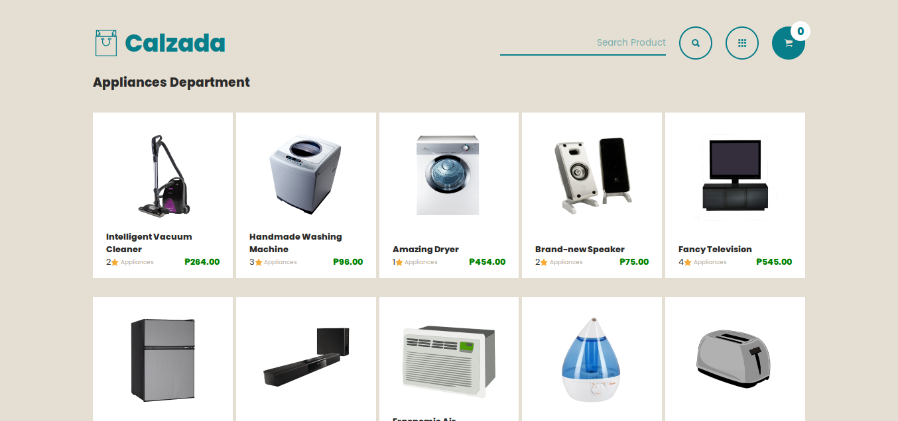

# DUMMY PRODUCTS REST API


This API aims to replicate the behaviour of various ecommerce website data and this is best for prototyping such kind of website. It provides dummy products with placeholder images with different sizes. I made this because I cannot find any api that can provide such dummy products, though there are some like ebay dev, however, its such as hassle to request an access and read through all the long documentation since all I need is a fake product as a placeholder. Faker js would do, however, I'm looking for something that matches at least the name of the product and its type/department. and here you go!

[Documentation](https://dummyproducts-api.herokuapp.com)

#### if you found this very useful, Please don't forget to star this repo! :tada: A rookie like me will highly appreaciate it

### FEATURES
* each dummy product has 3 dummy images (sizes 150x150, 300x300, 600x600) relative to product type (images used has CC license)
* each dummy product comes with description, prices, stock, ratings, and 5 reviews
* each dummy product query has an option to include similar products relative to its type or department
* with filters, you filter by ```stocks, sales, price, ratings``` with operators ```lt, gt, lte, gte``` (where in ```lt``` is 'less than', and ```lte``` 'less than or equal to', same pattern goes with ```gt``` & ```gte```)
	* filters will only work on ```/products``` and ```/products/search``` routes
* with search route, matches all product names depending on the query. You need to use query string keys ```term``` which will throw an error if not provided
* with pagination, you need to use query string keys ```page``` and ```limit```. You can use  both at the same time or one at a time
	* pagination (```page``` & ```limit```) can be used with all routes except ```/departments``` and ```/products/:product_id```
* with checkout, it only emulates the post request when buying something. nothing is inserted on the database but returns an object of the transaction

### SAMPLE
This is a dummy e-commerce website that consumes this API. This one is built using Vanilla JS wrapped with Typescript :tada: (just for experimentation)

You can visit the repo [here](https://github.com/rookiemonkey/dummy-ecommerce)
You can visit the website [here](https://krrb-prod-dummyecommerce.netlify.app/)





### TO DO LIST (OPEN FOR CONTRIBUTIONS)
- dummy users
- dummy cart
- remove unnecessary routes to utilize query strings
- add dimensions property on Product Model?
- add discount property on Product Model?

### CONTRIBUTING GUIDELINES

Please check this [contributing guidlines](https://github.com/rookiemonkey/dummy-products-api/blob/dev/CONTRIBUTING.md)

### CONTRIBUTORS ✨

Thank you for all who contributed to this project!

<table>
	<tr>
		<td align="center">
			<a href="https://github.com/justinbalaguer">
			<br /><sub><b>
Justin Balaguer</b></sub></a></a>
		</td>
	</tr>
</table>

## Author: <i>Kevin Roi R. Basina</i>
<a href="https://github.com/rookiemonkey">
	
</a>
<a href="https://ph.linkedin.com/in/kevin-roi-rigor-basina-668136185">
	
</a>
<a href="https://www.facebook.com/kevinroibasina">
	
<a>
<a href="https://www.instagram.com/timemachineni_roi/">
	
</a>
<a href="https://twitter.com/tymmchineni_roi">
	
</a>
<a href="mailto: kevinroirigorbasina@protonmail.com">
	
</a>
<a href="mailto: kevinroirigorbasina@gmail.com">
	
</a>